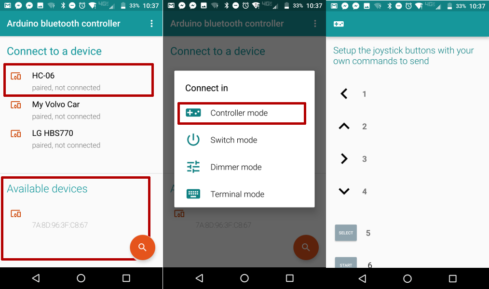
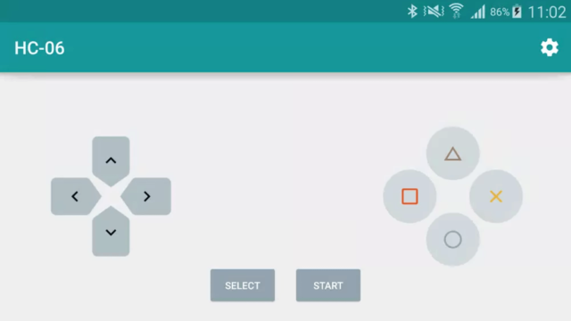

# CLEANING MACHINE

Рік випуску: __2019__ 
Версія: __1.7.7__ 
Розробник: __#ERROR404.TEAM__ 
Платформа: __Linux/Android__ 
 

Наш проект - це машинка для прибирання невеликих поверхонь, якою можна керувати за допомогою мобільного додатку Arduino Bluetooth Controller. 
За допомогою контроллера можна змінювати напрямок руху машинки та маніпулятора, до якого прикріплена губка або ганчірка для прибирання.

## Апаратне забезпечення

### Апаратні компоненти системи
Для збірки схеми проекту необхідно:
1.   Arduino UNO
2.  USB
3.  Ultrasonic Ranging Module HC - SR04
4.  Servo driver
5.  Breadboard
6.  HC-SR501 PIR Motion Detector
7.  GY-512
8.  Bluetooth-модуль ZS-040 (HC-05)
9.   Mother-mother, mother-father і father-father wires
10. Powerbank
11. Серво-привід (Servo Motor) SG90
12. Сервомеханізм AR-3606HB
13. Колеса

### Схема підключення

    
Відкрити

## Програмне забезпечення

### Програмні компоненти системи
Система розділена на програму на Arduino UNO та мобільний додаток Arduino Bluetooth Controller.

### Програмні бібліотеки
Код нашої “Cleaning Machine” використовує лише одну бібліотеку servo.h, яка встановлюється автоматично разом з Arduino IDE.

### Збірка
1. Для завантаження коду на плату Arduino необхідно завантажити Arduino IDE за [посиланням](https://www.arduino.cc/en/Guide/Linux).
2. Скачайте код машинки з github за [посиланням](https://github.com/progbase/Error404.Repository/blob/master/code).
3. Після встановлення програми, підключіть плату до комп'ютера за допомогою USB кабеля. 
4. Натисність кнопку [Upload] або (ctrl + U) - цим програма завантажиться до плати. 
5. Для того, щоб почати роботу з машинкою в “автономному стані” потрібно через USB шнур підключити Power Bank.

## Настанова користувача

1. Після завантаження коду на плату та встановлення мобільного додатку Arduino Bluetooth Controller на смартфон:
2. Включити живлення апаратної частини
3. Відкрити додаток на смартфоні та обрати пристрій з назвою HC-06 
4. Перейти в режим Controller Mode, який дозволяє керувати рухом машинки та маніпулятора. 
5. Налаштувати кнопки контроллера.

Після підключення режиму керування у мобільному додатку будуть доступні такі дії:
* Рух машинки вперед 
* Рух машинки назад 
* Поворот вліво на 360 градусів
* Поворот вправо на 360 градусів

Окрім цього, можливе також керування маніпулятором за допомогою кнопок:
* **Трикутник** - піднести маніпулятор вгору
* **Коло** - опустити маніпулятор вниз
* **Хрестик** - повитирати
 

